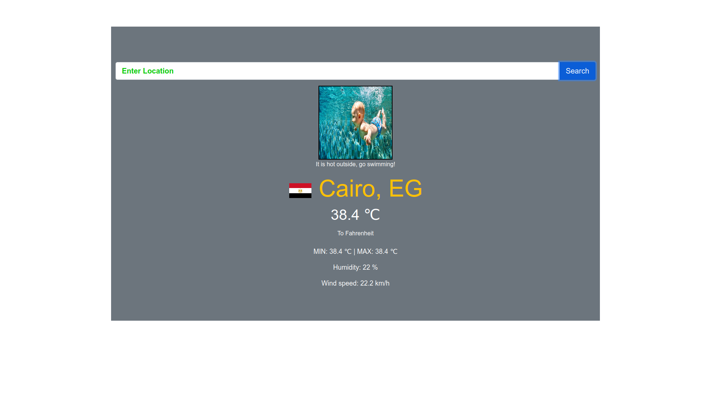

# Fabulous-tours

> The Weather app is a simple weather application that helps users to know the current weather status in Celsius as well as Fahrenheit.



## Built With

- HTML
- Bootstrap
- JavaScript
- Open Weather API
- Lots of love :heart:

## Live Demo

[View Live](https://condescending-bartik-4ead95.netlify.app/)

## Getting Started

To get a local copy of the repository please run the following commands on your terminal:

```git@github.com:Shaher-11/waetherjs.git```

```cd waetherjs```

```npm install```

```npm run build```


## Prerequisites

- [Visit](https://openweathermap.org/)
- Sign Up for free
- Copy the API key which will be sent your email
- Add the key to the weather.js file
- Open the app and enter the city name

👤 **Shaher Shamroukh**
 
[<code></code>](https://github.com/Shaher-11)
[<code></code>](https://twitter.com/ShaherShamroukh/)
[<code></code>](https://www.linkedin.com/in/shaher-shamroukh/)
 <a href="mailto:shahershamroukh@gmail.com?subject=Hey Shaher!"></a>
 

## Show your support

Give a ⭐️ if you like this project!

## Acknowledgments

- Microverse
- The Odin Project

## 📝 License

This project is [MIT](lic.url) licensed.
